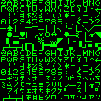

# pet2bmp
Convert Commodore PETSCII character ROM images into bitmap file(-s) and vice
versa(!).

Extract Commodore PETSCII characters from character ROM image files and make
them visible as bitmaps.

You can even modify the extracted bitmaps, turn them back into ROM files and
this way use your own font/modifications with your Commodore PET (e.g. via
custom EEPROM)!

**Commandline options:**

- Character ROM to bitmap file conversion:
  `pet2bmp b <input ROM file path> <output bitmap file path>`

- Bitmap to character ROM file conversion:
  `pet2bmp r <input bitmap file path> <output ROM file path>`

**Example:**

Input ROM file:

http://www.zimmers.net/anonftp/pub/cbm/firmware/computers/pet/characters-japan.901447-12.bin

Output bitmap file:

